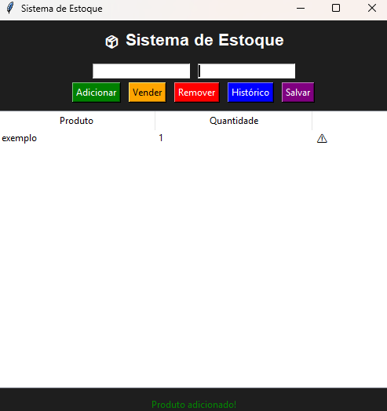

# 📦 Sistema de Controle de Estoque

Aplicação desenvolvida em Python com interface gráfica para gerenciamento de estoque.

## 🚀 Funcionalidades

- Adicionar produtos
- Remover produtos
- Registrar vendas
- Visualizar estoque em tabela
- Histórico de operações
- Alerta de estoque baixo
- Salvamento automático em arquivo

## 💻 Tecnologias utilizadas

- Python
- Tkinter (interface gráfica)
- JSON (armazenamento de dados)

## 🖥️ Como executar

1. Instale o Python na sua máquina
2. Baixe este repositório
3. Execute o arquivo:

```bash
python estoque_interface.py
## 📸 Demonstração


